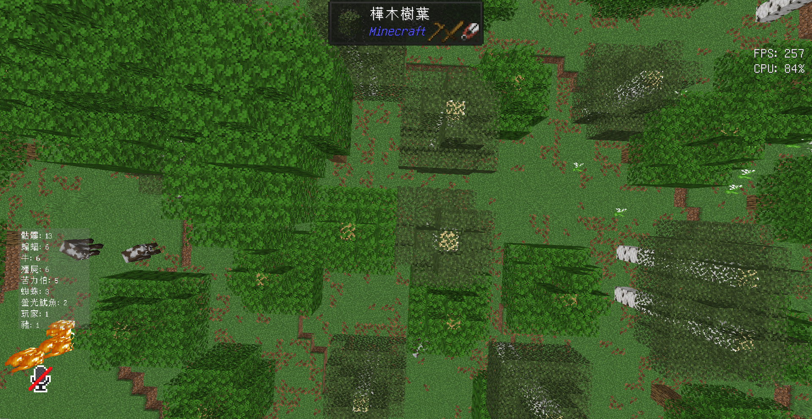

# EntityCount

A simple Minecraft mod that shows how many entities are around you in real-time.

## What does this mod do?

EntityCount displays a list on your screen showing how many of each type of entity (mobs, animals, items, etc.) are currently loaded around you. Perfect for:

## Customization

Access settings through **Mod Menu** → **EntityCount** → **Configure**

### Quick Settings
- **Turn on/off** the display
- **Show all entities** or **only living ones** (animals, mobs)
- **Change colors** text color, background color and text size
- **Move the display** anywhere on screen
- **Filter specific entities** with whitelist/blacklist

### Useful Options
- **Hide rare entities** - Only show entities with certain count
- **Limit display** - Show only top certain most common entities
- **Custom position** - Move display to any corner or position

---

✨ **Simple, lightweight, and works on both single-player and multiplayer!**